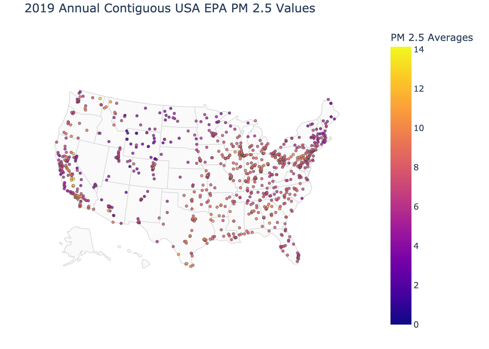
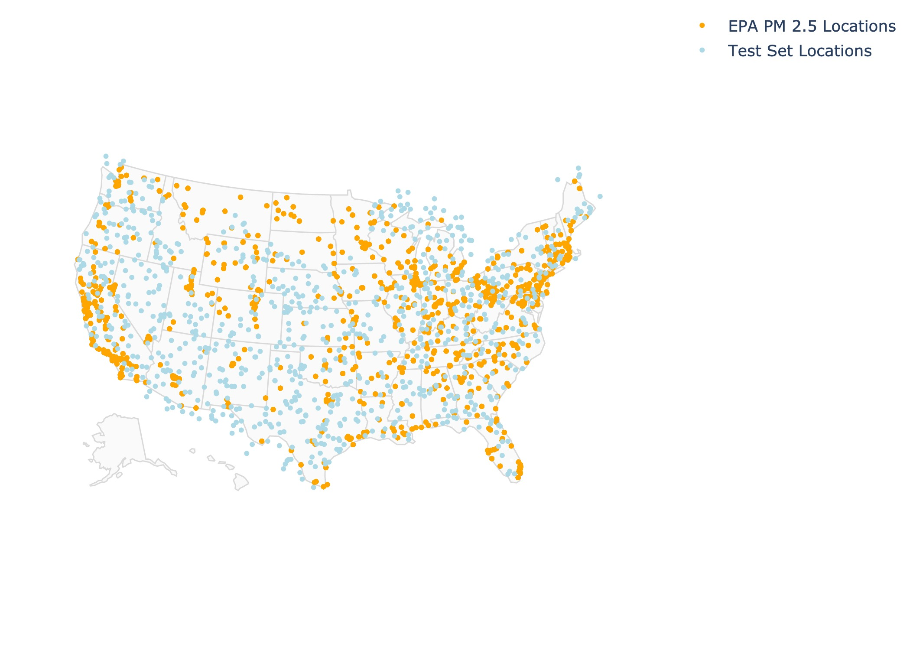
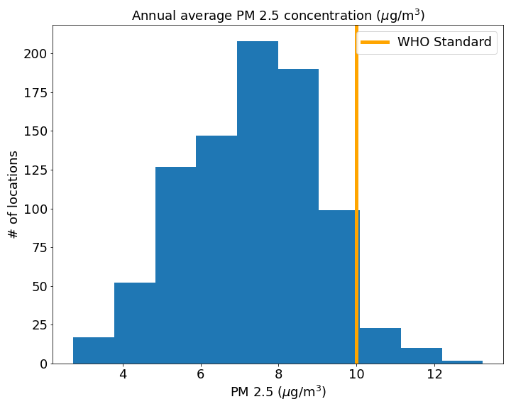
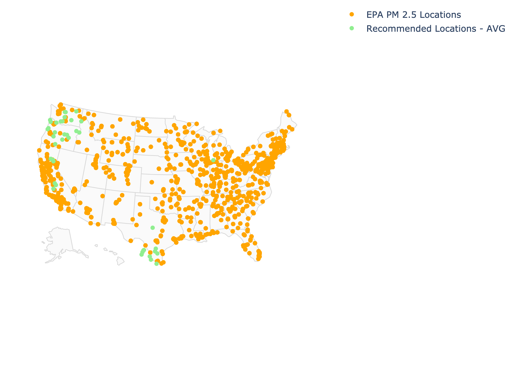
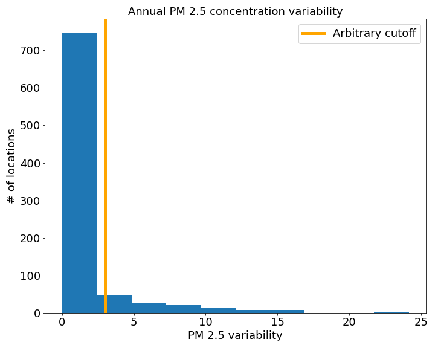
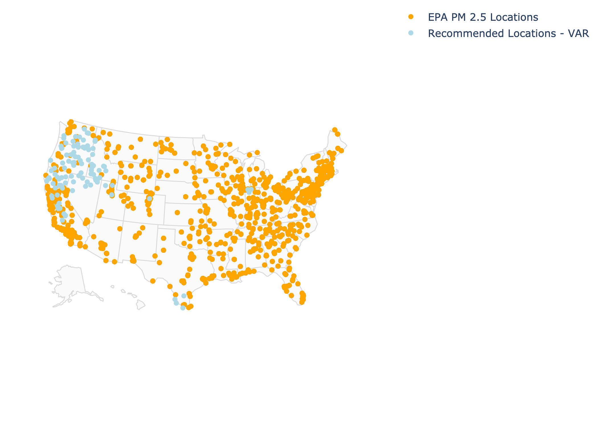

# Air Quality in the USA
### Group One - Joe Serigano, Adriana Machado, Prathik Chukkapalli
---
---
# Table of Contents
#### [Problem Statement and Background ](#Problem-Statement-and-Background)
#### [Data Gathering, Extracting, and Combining ](#Data-Gathering,-Extracting,-and-Combining)
#### [Modeling ](#Modeling)
#### [Predictions ](#Predictions)
#### [Conclusions and Recommendations ](#Conclusions-and-Recommendations)
#### [Data Descriptions ](#Data-Descriptions)

---
# Problem Statement and Background

Our group decided to try our own version of modeling to identify locations in the US that would benefit from PM 2.5 monitoring. PM 2.5 is particulate matter with a diameter less than 2.5 microns. Particles in the PM 2.5 size range are so dangerous because they are able to travel into the respiratory tract and lungs, affecting lung function and worsening pre-existing conditions and overall health.

Currently, in the US, many under-represented communities are not noticed by EPA due to lack of proper, consistent, and hyper-local monitoring. Many of these communities are located in industrial areas that need monitoring the most. 

>On December 13, 2021, EPA announced the availability of $20 million in American Rescue Plan funding through competitive grants to enhance ambient air quality monitoring in and near underserved communities across the United States [source.](https://www.epa.gov/arp/enhanced-air-quality-monitoring-funding-under-arp)

The application process ended on March 25, 2022. 

A new bill has been proposed that eases the application process and allows more time and resources for communities in need of block-by-block air quality monitoring.

>The program would have a $100 million annual budget over five years to allow local agencies to monitor the air quality in neighborhoods, block by block...If passed as currently written, the Environmental Justice Air Quality Monitoring Act would award grants or contracts to state, local and tribal agencies in partnership with local nonprofit groups or organizations that have a demonstrated ability to conduct hyperlocal air quality projects. The bill does not outline what steps should be taken if the air monitoring finds unacceptable levels of pollution in the air. The EPA said it does not comment on potential legislation...“Problems are able to be solved when we have data that points us to what the problems actually are, and monitoring is a huge step in the right direction,” Magzamen said[source.](https://www.propublica.org/article/representatives-introduce-500-million-air-quality-bill-citing-propublicas-investigations)

[Here's some proper data journalism](https://projects.propublica.org/toxmap/) that ProPublica released, identifying "Sacrifice Zones" that lack proper monitoring and have high cancer-causing rates. The independent investigation prompted the new bill, [The Environmental Justice Air Quality Monitoring Act of 2022](https://www.congress.gov/bill/117th-congress/senate-bill/2476), which is currently in Congress. 

This bill would award grants or contracts to state, local, and tribal agencies to install new air quality monitoring systems around communities afflicted by poor air quality. The EPA does not explicitly state where these monitors should be located and instead delegates the placement of these monitors to the agencies. The goal of this project is to create a model that accurately estimates PM 2.5 air quality measurements at current EPA monitoring sites using publicly available satellite data. We will then use this model to determine regions in the US that suffer from poor air quality (noted by high and/or highly variable PM 2.5 measurements in the region) and recommend locations in the US that could benefit from more air quality monitoring. The goal of this project is not to determine the placement of hyperlocal monitors, but instead to determine regions of the US that could benefit from further analysis at higher spatial resolution.

---
# Data Gathering, Extracting, and Combining

### Target variable
We used recent open-source 2019 EPA daily monitoring data for [PM2.5 FRM/FEM Mass (88101)](https://aqs.epa.gov/aqsweb/airdata/download_files.html), and found the average PM 2.5 measurement for each month of 2019. We chose to analyze 2019 because this was the last full pre-pandemic year for which data were available and the pandemic drastically changed global air quality due to lockdowns. Locations of EPA ground monitoring sensors can be seen in the figure below:

### Model features 

Our features will be publicly available satellite data that includes latitude, longitude, temperature, precipitation, aerosol optical depth, and NO2. Our model uses these features to estimate the value of EPA PM 2.5 ground monitoring measurements. From here, we expand our model to make predictions at other randomized latitude and longitude locations to determine the variability of PM 2.5. Locations with the highest PM 2.5 variability and highest overall PM 2.5 values will be locations where we strongly recommend new EPA air quality monitor placement.

Long term exposure to fine particulate matter like PM2.5 causes ~8 million excess deaths annually, so developing a model that can understand temporal and spatial variability in air pollution is a crucial component to combatting air quality inequalities when ground monitoring is not available. In the US, PM 2.5 was associated with ~40,000 premature deaths in 2019, an economic cost that translates to ~$500 billion USD. The health impacts of PM2.5 are not experienced equally in the U.S.: ethnoracial minorities face significantly higher burdens of PM2.5-attributable premature mortality. Sources of PM 2.5 include most forms of well-known pollution: power plants, fossil fuel consumption (traffic, construction, most forms of transportation), burning of wood, and forest and grass fires. Sources also include, to a lesser extent, smoking, cooking, and burning candles.

Precipitation has a negative correlation to PM2.5 concentration. Precipitation “washes” the air of particulate matter. On the other hand, temperature has a positive correlation to PM2.5 concentration. Higher temperatures lead to more reactions within the atmosphere, leading to more particulate matter. Temperature and precipitation data were pulled from [NASA GIOVANNI](https://giovanni.gsfc.nasa.gov/giovanni/), a data acquisition tool to pull satellite data. Precipitation data came from the Global Precipitation Monitor satellite at a resolution of 0.1 degree. Temperature data came from the Moderate Resolution Imaging Spectroradiometer (MODIS) instrument aboard the Aqua satellite at a resolution of 0.05 degrees.

NO2 and PM 2.5 have similar links to overall health and have similar sources, primarily from the burning of fuel. NO2 forms from emissions from cars, trucks and buses, power plants, and off-road equipment and is equally dangerous to health, especially asthma in younger people. NO2 data came from the TROPOspheric Monitoring Instrument (TROPOMI) instrument aboard the Sentinel 5 at a resolution of 0.1 degrees. This data set was used in [Kerr et al. 2022](https://www.pnas.org/doi/abs/10.1073/pnas.2022409118) and access to the data set can be found [here](https://gwu.app.box.com/s/8phdj2gtux6gjwzit35skptx8hxl8d9d?page=2). 

Aerosol optical depth (AOD) is a measure of the amount of dust/haze in the atmosphere and tells us how much direct sunlight is prevented from reaching the ground due to aerosol particles. AOD and PM 2.5 have a positive correlation since PM 2.5 is itself an aerosol. AOD data came from the Moderate Resolution Imaging Spectroradiometer (MODIS) instrument aboard the Aqua satellite. NASA GIOVANNI only offers these data at a resolution of 0.25 degrees. In order to obtain a finer resolution we used a high-resolution gridded data set found in [Gupta et al. 2020](https://www.mdpi.com/2072-4292/12/17/2847) which can be found [here](https://www.nsstc.uah.edu/data/sundar/MODIS_AOD_L3_HRG/AQUA/).

### Building Our Training Dataset
Data consistency and cleanliness proved to be obstacles in creating our training data set. 

- The resolution of latitudes and logitudes varied between variable sets and the EPA set, so we had to create a function that would search for a reasonable lat/lon range (mostly within .1 degrees) then extract the variable and assign it to the related EPA location. 
- This became a lengthier process than anticipated but we were able to create a training set with almost 14,000 data points for 2019 (contiguous US). 
- Each data point represents an EPA entry, its monthly PM 2.5 average, and the entry's 4 variables' monthly averages for each month of 2019. 
- A small amount of EPA entries had PM 2.5 readings <= 0 which may be due to malfunctioning monitors [source.](https://www.researchgate.net/post/How_can_I_deal_with_negative_and_zero_concentrations_of_PM25_PM10_and_gas_data)

---
# Modeling

We ran various regression models from simple to complex stacked models using boosting, trees, etc. The model that had the best training and test scores was a simple Random Trees Model. Although not an ideal test score, and very overfit, this model performed much better than all other models. One stacked model came close but not enough to beat Random Trees. Not too bad for a training set based off EPA monitor location data that doesn't have standardized selection. 

Training Score: 0.935
Test Score: 0.705

---
# Predictions
### Building Our Test Dataset
1,000 random latitude and longitude data points across the contiguous United States were created in order to run through our model to predict monthly PM 2.5 measurements. The location of these random data point compared to the EPA monitoring sites can be found below:

---
# Conclusion and Recommendations
## Conclusion
We analyzed two factors to determine recommendations on where the EPA should place new monitors: Average annual PM 2.5 concentration, and annual PM2.5 variability. A high annual PM 2.5 concentration is indicative of an area with a lot of pollution and poor air quality year round. High PM 2.5 variability could be anthropogenic, or could be natural. This includes factories which would pollute only when they are active, cities which would pollute more during commuting hours, and wildfires or other natural causes that create poor air quality. 

A histogram of annual averages for all ~1000 data points is show below:

The World Health Organization Air Quality Guidelines (WHO AQG) recommend an annual PM 2.5 exposure below 10 μg/m3, which is seen on the figure in a yellow vertical line. Locations above this value have been flagged as recommended sites for monitoring. The figure below shows these locations in blue, with EPA monitor sites shown in orange:

A histogram of PM2.5 variability for all ~1000 data points is show below:

In this case, there are no guidelines but there are clear outliers to this data set. We set an arbitrary cutoff of 3 and recommend the sites above this value for EPA PM2.5 ground monitoring. The figure below shows these locations in blue, with EPA monitor sites shown in orange:

Both recommendation systems produce similar results. We see some recommended sites at the southern tip of Texas and many other sites on the west coast and specifically the Pacific Northwest. The high PM2.5 and high variability on this coast is most likely due to seasonal wildfires. 

## Recommendations
Cleaner input data and more variables would help make predicting PM 2.5 stronger. The resolution of location data left room for error in the extraction of variables but within <=1 degree of latitudes and longitudes. 

Training and testing variability across multiple years would give more variability insights to determine causes.  

Other variables like proximity to industrial areas, population, feature relationships, etc.

Using ground data versus atmostpheric data. 

- For satellite data to work, we must have a clear, cloud-free sky for accurate measurements
- Snow/ice reflectance obscures measurements
- Satellites can only make measurements during the day, leaving out a lot of readings that should be happening at night when conditions change
- Ground-based monitors typically take hourly measurements while satellite capability is much sparser

---
# Data Descriptions

Data dictionary with all primary data folders and files. Items excluded were used for various processing reasons. 

| Parent Folder | Filename/Folder | Type | Description |
| ------------- | --------------- | ---- | ----------- |
| main | README | markdown | Description of project, modeling, and conclusions |
| data | epa_final | .csv | Combined dataset for EPA monitor locations and PM2.5 and variable monthly averages |
| data | AODdata_cleaned | folder | Contains 3 folders for 2018, 2019, and 2021 with monthly datasets for the AOD variable |
| data | monthly_test_data | folder | Contains 2 folders with monthly datasets for combined variable and location features - one folder has a smaller test set and one with a larger test |
| data | NO2data_cleaned | folder | Contains monthly datasets for the NO2 variable |
| data | precipdata_cleaned | folder | Contains monthly datasets for the precipitation variable |
| data | tempdata_cleaned | folder | Contains monthly datasets for the temperature variable |
| images | images | folder | Folder with .png and .jpeg plots for the presentation |
| notebooks | 01_cleaning_monthly_daily_EPA_2019 | .ipynb | Notebook used aggregating daily EPA data into monthly PM 2.5 averages |
| notebooks | 01_cleaning_satellite_data | .ipynb | Notebook used for extracting and combining satellite variable datasets |
| notebooks | 02_1_cleaning_epa_lat_lon | .ipynb | Notebook used for extracting and combining the monthly variable datasets with EPA monthly data |
| notebooks | 02_1_random_lat_lon | .ipynb | Notebook used for creating a randomly chose set of 1k locations in the US |
| notebooks | 02_2_cleaning_test_data | .ipynb | Notebook used for extracting and combining test data set's locations and variables |
| notebooks | 03_EDA | .ipynb | Notebook used for timeseries and geographical EDA on train and test set |
| notebooks | 04_model_testing | .ipynb | Notebook used experimenting with models |
| notebooks | 04_more_model_testing | .ipynb | More models tested |
| notebooks | 05_1_final_modeling | .ipynb | Winning model and predictions/aggregating on test dataset |
| notebooks | 05_2_results_analysis | .ipynb | Winning model and predictions/aggregating on test dataset |# group-1-air-quality

